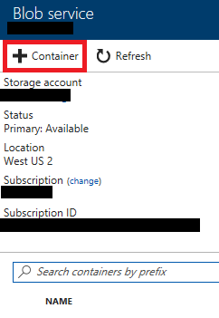
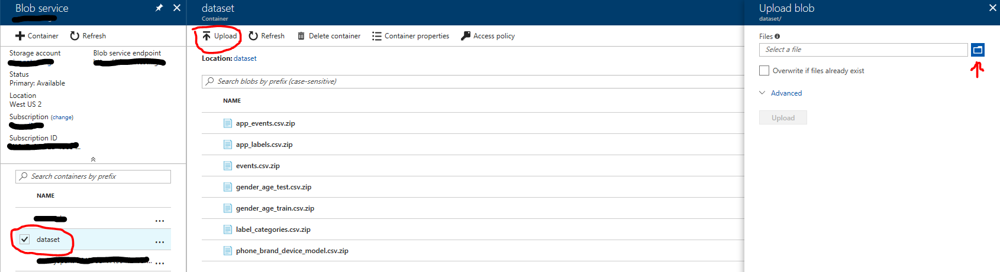
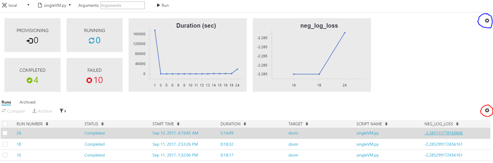
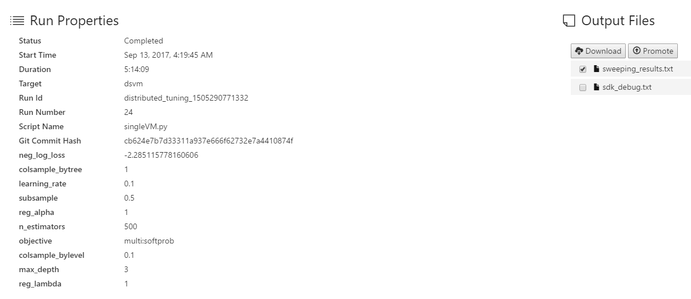

# Distributed Tuning of Hyperparameters using Azure Machine Learning Workbench

## Introduction

This scenario shows how to use Azure Machine Learning (AML) Workbench to scale out tuning of hyperparameters of machine learning algorithms that implement scikit-learn API. We show how to configure and use remote Docker container and Spark cluster as an execution backend for tuning hyperparameters.

## Use case overview

Many machine learning algorithms have one or more knobs, called hyperparameters. These knobs allow tuning of algorithms to optimize their performance over future data, measured according to user-specified metrics (for example, accuracy, AUC, RMSE). Data scientist needs to provide values of hyperparameters when building a model over training data and before seeing the future test data. How based on the known training data can we set up the values of hyperparameters so that the model has a good performance over the unknown test data? 

A popular technique for tuning hyperparameters is a *grid search* combined with *cross-validation*. Cross-validation is a technique that assesses how well a model, trained on a training set, predicts over the test set. Using this technique, initially we divide the dataset into K folds and then train the algorithm K times, in a round-robin fashion, on all but one of the folds, called held-out fold. We compute the average value of the metrics of K models over K held-out folds. This average value, called *cross-validated performance estimate*, depends on the values of hyperparameters used when creating K models. When tuning hyperparameters, we search through the space of candidate hyperparameter values to find the ones that optimize cross-validation performance estimate. Grid search is a common search technique, where the space of candidate values of multiple hyperparameters is a cross-product of sets of candidate values of individual hyperparameters. 

Grid search using cross-validation can be time-consuming. If an algorithm has 5 hyperparameters, each with 5 candidate values and we use K=5 folds, then to complete a grid search we need to train 56=15625 models. Fortunately, grid-search using cross-validation is an embarrassingly parallel procedure and all these models can be trained in parallel.

## Outline

- [Prerequisites](#prereqs)
- [Provision Azure Resources](#provision)
   - [Choose a Unique String](#unique)
   - [Create a Resource Group](#rg)
   - [Create a Storage Account with Source Data](#storageaccount)
   - [Create an Ubuntu DSVM](#dsvm)
   - [Create an HDInsight Spark cluster](#hdinsight)  
- [Model Tuning with AML Workbench](#useamlworkbench)
   - [Create a New Project](#createproj)
   - [Hyperparameter Tuning in Remote Docker Container](#tuning_docker)
   - [Hyperparameter Tuning in HDInsight Spark Cluster](#tuning_sparkcluster)
- [Extended Reading](#details)
	- [Feature Engineering](#featurnengineering)
	- [Compute in Remote Docker Container](#er_docker)
	- [Compute in Spark Cluster](#er_cluster)
- [Architecture Diagram](#diagram)
- [Conclusion](#conclusion)
- [References](#reference)

## Prerequisites

Before you begin, ensure that you have the following:

* An [Azure account](https://azure.microsoft.com/en-us/free/) (free trials are available).
* An installed copy of [Azure Machine Learning Workbench](./overview-what-is-azure-ml.md) following the [quick start installation guide](./quick-start-installation.md) to install the program and create a workspace.
* This scenario assumes that you are running AML Workbench on Windows 10 or MacOS with Docker engine locally installed. 
* To run scenario with remote Docker container, provision Ubuntu Data Science Virtual Machine (DSVM) by following the instructions [here](https://docs.microsoft.com/en-us/azure/machine-learning/machine-learning-data-science-provision-vm). We recommend using a virtual machine with at least 8 cores and 28 Gb of memory. D4 instances of virtual machines have such capacity. 
* To run this scenario with Spark cluster, provision HDInsight cluster by following the instructions [here](https://docs.microsoft.com/en-us/azure/hdinsight/hdinsight-hadoop-provision-linux-clusters). We recommend having a cluster with at least six worker nodes and at least 8 cores and 28 Gb of memory in both header and worker nodes. D4 instances of virtual machines have such capacity. To maximize performance of the cluster, we recommend to change the parameters spark.executor.instances, spark.executor.cores, and spark.executor.memory by following the instructions [here](https://docs.microsoft.com/en-us/azure/hdinsight/hdinsight-apache-spark-resource-manager) and editing the definitions in "custom spark defaults" section.

     >**Note**: Your Azure subscription might have a quota on the number of cores that can be used. Azure portal does not allow creation of cluster with the total number of cores exceeding the quota. To find you quota, go in Azure portal to Subscriptions section, click on the subscription used to deploy a cluster and then click on Usage+quotas. Usually quotas are defined per Azure region and you can choose to deploy Spark cluster in a region where you have enough free cores.
* Create Azure storage account that is used for storing dataset. You can find instructions for creating storage account [here](https://docs.microsoft.com/en-us/azure/storage/common/storage-create-storage-account).
* Source data. The data can be downloaded from [TalkingData dataset](https://www.kaggle.com/c/talkingdata-mobile-user-demographics/data) (Seven files including app\_events.csv.zip, 
app\_labels.csv.zip, events.csv.zip, gender\_age\_test.csv.zip, gender\_age\_train.csv.zip, label\_categories.csv.zip, phone\_brand\_device\_model.csv.zip).   

## Provision Azure Resources

### Choose a Unique String

To help keep track of the Azure resources you create in this tutorial, we suggest that you select a unique string that will be incorporated into the name of each Azure resource you create. This string should include only lowercase letters and numbers, and be less than 20 characters in length. To ensure that your string is unique and has not been chosen by another Azure user, we recommend including your initials as well as a random number. 

### Create a Resource Group

We recommend creating all the Azure resources needed for this tutorial under the same, temporary resource group: you can then easily delete all the resources in one go once you are finished with this deployment guide. You will be asked to choose a location for your resource group: we recommend choosing a location in which your Azure subscription has at least 24 cores available for the creation of a HDInsight cluster. (There is typically no limit in the creation of the other types of Azure resources used in this tutorial).

To create the resource group:

1. Log into the [Azure Portal](https://ms.portal.azure.com/).
1. Press the "+ New" button located at the upper left portion of the screen.
1. Type "Resource group" into the search box and then press Enter.
1. Click on the "Resource group" option published by Microsoft from the search results. Click on the blue "Create" button that appears on right pane.
1. In the new pane:    
    1. Enter your **unique string** for the "Resource group name".
    1. Select the appropriate subscription and resource group location.
    1. Check the "Pin to dashboard" checkbox option.
    1. Press "Create".
    > **NOTE:** The resource availability in different regions depends on your subscription. When deploying you own resources, make sure all data storage and compute resources are created in the same region to avoid inter-region data movement. Azure Resource Group does not have to be in the same region as the other resources. It is a virtual group that groups all the resources into one solution. All the above mentioned resources should be deployed using the same subscription.
    
You will be taken to the resource group's overview page when the deployment is complete. In the future, you can navigate to the resource group's overview page from your [Azure Portal](https://ms.portal.azure.com/) dashboard.

#### Create a Storage Account with Source Data 

1. Log into the [Azure Portal](https://ms.portal.azure.com/).
1. Press the "+ New" button at the upper left portion of the screen.
1. Type "storage account" into the search box and then press Enter.
1. Click on the "storage account - blob, file, table, queue" option published by Microsoft from the search results. Click on the blue "Create" button that appears on the  right pane.
1. In the "Create storage account" pane that appears:
    1. Enter your **unique string** in the "Name" field.
    1. Select the appropriate subscription, resource group, and location.
    1. Click "Create".

The storage account should be deployed momentarily. You will need the primary key for your storage account to proceed with the model tuning job in python scripts. To find the storage account's key:

1. Navigate to the resource group's overview pane.
1. Click on the resource of type "Storage account" once it has deployed. (You may need to refresh the list).
1. In the storage account overview pane that appears, click on the "Access keys" link on the left-hand list.
1. Press the "Click to copy" button next to "key1" to copy the primary key to your clipboard. Save this key in a memo file where you can easily access it as you continue through this guide.

You will also need to create a container inside the storage account to store glucose level readings for later:

1. Navigate to the storage account's overview pane and click "Blobs".
1. Click the "+ Container" button at the upper left in the "Blob service" pane that appears.
1. Create a container named `dataset` with "Private" access type.
1. Upload the source data files to the `dataset` container:
   1. Click on the container named `dataset` in the "Blob service" pane. Click "Upload".
   1. In your local machine, locate the seven files downloaded from [TalkingData dataset](https://www.kaggle.com/c/talkingdata-mobile-user-demographics/data) (app\_events.csv.zip, 
app\_labels.csv.zip, events.csv.zip, gender\_age\_test.csv.zip, gender\_age\_train.csv.zip, label\_categories.csv.zip, phone\_brand\_device\_model.csv.zip).
	1. Click "Upload."
	> **Note:** A Kaggle account is needed to download these files.
   
The following screenshots illustrate these steps:

 

### Create an Ubuntu Data Science Virtual Machine (DSVM)
	 **NOTE:** This Azure resource is only needed if you want to tune the models with the remote Docker container.

1. Log into the [Azure Portal](https://ms.portal.azure.com/).
1. Press the "+ New" button at the upper left portion of the screen.
1. Type "data science virtual machine" into the search box and then press Enter.
1. Click on the "Data Science Virtual Machine for Linux (Ubuntu)" option published by Microsoft from the search results. Click on the blue "Create" button that appears on the  right pane.
1. In the "Basics" pane that appears:
    1. Enter your **unique string** in the "Name" field.
    1. Enter **your user name** the "User name" field.
    1. Select Password as "Authentication" type.
    1. Enter **your password** the "Password" field and "Confirm password".
    1. Select the appropriate subscription, resource group, and location.
    1. Click "OK".
1. In the "Size" pane that appears:
	1. Choose "DS4_V2 Standard" machine or above to have at least 8 cores and 28 Gb of memory.
	1. Click "Select".

1. Leaving default setting in "Settings" pane and click "OK".
1. Click "Purchase" in "Purchase".

### Create a HDInsight Spark cluster
	**NOTE:** This Azure resource is only needed if you want to tune the models with the Spark cluster.
We recommend creating a HDInsight Spark cluster to train, evaluate, and apply the machine learning model on a predefined schedule to new data. To deploy the cluster:
 
1. Log into the [Azure Portal](https://ms.portal.azure.com/).
1. Press the "+ New" button at the upper left portion of the screen.
1. Type "HDInsight" into the search box and then press Enter.
1. Click on the "HDInsight" option published by Microsoft from the search results. Click the blue "Create" button that appears on the right pane.
1. In the "Basics" pane that appears:
    1. Enter your **unique string** in the "Cluster name" field.
    1. Choose the appropriate subscription.
    1. Click on Cluster type to load additional options:
       1. Choose "Spark" from the "Cluster type" drop-down menu.
       1. Choose "Spark 2.1.0 (HDI 3.6)" as the version number.
       1. Click "Select".
    1. Choose a cluster login name and password (ensure to note this down for future reference).
    1. Leave the secure shell (SSH) settings with their default values.
    1. Select the appropriate resource group and location.
    1. Press "Next".
1. In the "Storage" pane that appears:
    1. Ensure that the "Primary storage type" is set to "Azure Storage".
    1. Under the "Selection method", choose "My subscriptions".
    1. Under "Select a storage account", click the small arrow and enter your **unique string** as the storage account name under appropriate subscription. This is the storage account created in a previous step.
    1. Leaving all other fields at their default values, then click "Next".
1. In the "Summary" pane that appears:
    1. Click on the "Edit" link next to "Cluster size".
    1. Ensure that the number of worker nodes is set to "6". (Select the option 'View all' if you do not see this option by default).
    1. Set the "Worker node size" and "Head node size" to "D4 V2 Optimized". (Select the option 'View all' if you do not see this option by default).
    1. Click "Next".
1. Click "Next" at the bottom of the "Advanced settings" pane that appears.
1. Click "Create" at the bottom of the "Summary" pane that appears.

	> **Note:** The cluster deployment may take around twenty minutes to complete. As you wait for the cluster deployment, you can proceed with the modeling tuning expriments in remote Docker container compute environment first.

## Model Tuning with Azure Machine Learning (AML) Workbench
This section mainly outlines the step-by-step instructions on how to perform the modeling tuning exercise using AML Workbench. In order to further understand how the machine learning tasks are implemented and why the experiments are performed in such as way, please refer to section [Extended Reading](#details) for details.

We recommend to clone, or download/extract, a copy of [this git repository](https://github.com/Azure/MachineLearningSamples-DistributedHyperParameterTuning) in order to conveniently refer to the files in the [Code](https://github.com/Azure/MachineLearningSamples-DistributedHyperParameterTuning/Code) folder.

We define the 
"Code" folder in your copy of [this git repository](https://github.com/Azure/MachineLearningSamples-DistributedHyperParameterTuning) as "**origin code**" folder; and the name of your new created AML Workbench project folder as "**your project**" folder. Blew section shows how this new project is created.

### Create a New Project

Following steps show how to configure the settings in AML Workbench:

1. Launch AML Workbench and create a new project.
1. In the next steps, we connect execution environment to Azure account. 
	1. Open command line window (CLI) by clicking File menu in the top left corner of AML Workbench and choosing "Open Command Prompt." Then run following command in CLI:
		> az login
	
	1. Above command produces following response. Open a browser and navigate to https://aka.ms/devicelogin and enter the **YOUR_CODE**. You will sign into your Azure account.
		> To sign in, use a web browser to open the page https://aka.ms/devicelogin and enter the code **YOUR_CODE** to authenticate.
	1. Switch back to the CLI console and run following command:
		> az account list -o table
	1. Locate the subscription ID of your Azure subscription that has your AML Workbench Workspace account. Then run folloiwng command in CLI to complete the connection to your Azure subscription.
		> az account set -s <subscription ID>

1. Copy all the .py files from the origin code folder to your project folder. 
1. Locate the load\_data.py file in your project folder and open it. As shown below, replace the ACCOUNT_NAME and ACCOUNT_KEY variable with your provisioned storage account name and key. Save and close this file. Notice that you do not need to run load\_data.py file manually. Later on it will be called from other files.
		
		from azure.storage.blob import BlockBlobService
    	# Define storage parameters 
   		ACCOUNT_NAME = "<ACCOUNT_NAME>"
   		ACCOUNT_KEY = "<ACCOUNT_KEY>"
    	CONTAINER_NAME = "dataset"

  
1. Replace the existing conda_dependencies.yml file in the aml_config folder of your project folder with the same file from the aml_config folder of origin code folder. 

	> The purpose is to install these packages in Docker image and in the nodes of Spark cluster. The modified file is shown as following: 

   		 name: project_environment
 	  	 channels:
 	     	- conda-forge
 		 dependencies:
  	 		- python=3.5.2
  	  	 	- scikit-learn
   	 	  	- xgboost
   	  		- pip:
   	     		- cryptography
    	    	- azure
     	  		- azure-storage
    

### Hyperparameter Tuning in Remote Docker Container

1. To set up a remote Docker container, run following command in CLI with your DSVM's IP address, user name and password of . These information can be found in Overview section of your provisioned DSVM resource in Azure portal.

    > az ml computetarget attach --name mydsvm --address <IP address> --username <username> --password <password> --type remotedocker

1. Before running Python scripts in remote DSVM for the first time, we create a Docker container there by running following command in CLI console. Creation of Docker container takes several minutes.

    > az ml experiment prepare -c mydsvm

1. Run following command in CLI console to execute singleVM.py in DSVM. This command finishes in 1 hour 38 minutes when the provisioned DSVM has 8 cores and 28 Gb of memory.

    > az ml experiment submit -c mydsvm .\singleVM.py

 The logged values can be viewed in Run History window of AML Workbench:

**Result Interpretation**

By default Run History window shows values and graphs of the first 1-2 logged values. To see the full list of the chosen values of hyperparameters, click on the settings icon marked with red circle in the previous screenshot and select the hyperparameters to be shown in the table. Also, to select the graphs that are shown in the top part of Run History window, click on the setting icon marked with blue circle and select the graphs from the list. 

The chosen values of hyperparameters can also be examined in Run Properties window: 

In the top right corner of Run Properties window there is a section Output Files with the list of all files that were created in '.\output' folder in the execution environment. sweeping\_results.txt can be downloaded from there by selecting it and clicking Download button. sweeping_results.txt should have the following output:

    metric =  neg_log_loss
    mean: -2.29096, std: 0.03748, params: {'colsample_bytree': 1, 'learning_rate': 0.1, 'subsample': 0.5, 'n_estimators': 300, 'reg_alpha': 1, 'objective': 'multi:softprob', 'colsample_bylevel': 0.1, 'reg_lambda': 1, 'max_depth': 3}
    mean: -2.28712, std: 0.03822, params: {'colsample_bytree': 1, 'learning_rate': 0.1, 'subsample': 0.5, 'n_estimators': 400, 'reg_alpha': 1, 'objective': 'multi:softprob', 'colsample_bylevel': 0.1, 'reg_lambda': 1, 'max_depth': 3}
    mean: -2.28706, std: 0.03863, params: {'colsample_bytree': 1, 'learning_rate': 0.1, 'subsample': 0.5, 'n_estimators': 300, 'reg_alpha': 1, 'objective': 'multi:softprob', 'colsample_bylevel': 0.1, 'reg_lambda': 1, 'max_depth': 4}
    mean: -2.28530, std: 0.03927, params: {'colsample_bytree': 1, 'learning_rate': 0.1, 'subsample': 0.5, 'n_estimators': 400, 'reg_alpha': 1, 'objective': 'multi:softprob', 'colsample_bylevel': 0.1, 'reg_lambda': 1, 'max_depth': 4}

### Hyperparameter Tuning in HDInsight Spark Cluster
 
1. To set up Spark environment, run following command in CLI with the name of the cluster, cluster's SSH user name and password. The default value of SSH user name is `sshuser`, unless you changed it during provisioning of the cluster. The name of the cluster can be found in Properties section of your cluster page in Azure portal.

    > az ml computetarget attach --name myspark --address <cluster name>-ssh.azurehdinsight.net  --username sshuser --password <password> --type cluster

1. Replace the existing spark\_dependencies.yml file in the aml_config folder of your project folder with the same file from the aml_config folder of origin code folder.

	> The purpose is to configure for Spark execution environment:

    	configuration: {}
    	repositories:
     	 - "https://mmlspark.azureedge.net/maven"
    	  - "https://spark-packages.org/packages"
   		 packages:
    	  - group: "com.microsoft.ml.spark"
    	    artifact: "mmlspark_2.11"
    	    version: "0.7"
    	  - group: "databricks"
    	    artifact: "spark-sklearn"
      	  version: "0.2.0"

## Extended Reading
This section is for further understanding the machine learning process. It is not required in order to finish the model turning exercise.

### Feature engineering
The code for computing all features is in feature\_engineering.py file in your project folder. You do not need to run feature_engineering.py file manually, as it is called from other files.

We create multiple feature sets:
* One-hot encoding of brand and model of the cell phone (one\_hot\_brand_model function)
* Fraction of events generated by user in each weekday (weekday\_hour_features function)
* Fraction of events generated by user in each hour (weekday\_hour_features function)
* Fraction of events generated by user in each combination of weekday and hour (weekday\_hour_features function)
* Fraction of events generated by user in each app (one\_hot\_app_labels function)
* Fraction of events generated by user in each app label (one\_hot\_app_labels function)
* Fraction of events generated by user in each app category (text\_category_features function)
* Indicator features for categories of apps that were used by used to generated events (one\_hot_category function)

These features were inspired by Kaggle kernel [A linear model on apps and labels](https://www.kaggle.com/dvasyukova/a-linear-model-on-apps-and-labels).

The computation of these features requires significant amount of memory. Initially we tried to compute features in the local environment with 16 Gb RAM. We were able to compute the first four sets of features, but received 'Out of memory' error when computing the fifth feature set. The computation of the first four feature sets is in singleVMsmall.py file and it can be executed in the local environment by running following command in CLI console.

	az ml experiment submit -c local .\singleVMsmall.py   

Since local environment is too small for computing all feature sets, we switch to remote DSVM that has larger memory. The execution inside DSVM is done inside Docker container that is managed by AML Workbench. By using this DSVM we are able to compute all features and train models and tune hyperparameters. singleVM.py file has complete feature computation and modeling code. In the section [Hyperparameter Tuning in Remote Docker Container](#tuning_docker), we show how to run singleVM.py in remote DSVM. 

### Compute in Remote Docker Container

We use [xgboost](https://anaconda.org/conda-forge/xgboost) implementation [[1]](#reference) of gradient tree boosting. We use [scikit-learn](http://scikit-learn.org/) package to tune hyperparameters of xgboost. Although xgboost is not part of scikit-learn package, it implements scikit-learn API and hence can be used together with hyperparameter tuning functions of scikit-learn. 

Xgboost has eight hyperparameters:
* n_esitmators
* max_depth
* reg_alpha
* reg_lambda
* colsample\_by_tree
* learning_rate
* colsample\_by_level
* subsample
* objective
A description of these hyperparameters can be found [here](http://xgboost.readthedocs.io/en/latest/python/python_api.html#module-xgboost.sklearn) and [here](https://github.com/dmlc/xgboost/blob/master/doc/parameter.md). 
Initially we use remote DSVM and tune hyperparameters from a small grid of candidate values:

    tuned_parameters = [{'n_estimators': [300,400], 'max_depth': [3,4], 'objective': ['multi:softprob'], 'reg_alpha': [1], 'reg_lambda': [1], 'colsample_bytree': [1],'learning_rate': [0.1], 'colsample_bylevel': [0.1,], 'subsample': [0.5]}]  

This grid has four combinations of values of hyperparameters. We use 5-fold cross validation, resulting 4x5=20 runs of xgboost. To measure performance of the models, we use negative log loss metric. The following code finds the values of hyperparameters from the grid that maximize the cross-validated negative log loss. The code also uses these values to train the final model over the full training set:

    clf = XGBClassifier(seed=0)
    metric = 'neg_log_loss'
    
    clf_cv = GridSearchCV(clf, tuned_parameters, scoring=metric, cv=5, n_jobs=8)
    model = clf_cv.fit(X_train,y_train)

After creating the model, we save the results of the hyperparameter tuning. We use logging API of AML Workbench to save the best values of hyperparameters and corresponding cross-validated estimate of the negative log loss:

    from azureml.logging import get_azureml_logger

    # initialize logger
    run_logger = get_azureml_logger()

    ...

    run_logger.log(metric, float(clf_cv.best_score_))

    for key in clf_cv.best_params_.keys():
        run_logger.log(key, clf_cv.best_params_[key]) 

We also create sweeping_results.txt file with cross-validated negative log losses of all combinations of hyperparameter values in the grid:

    if not path.exists('./outputs'):
        makedirs('./outputs')
    outfile = open('./outputs/sweeping_results.txt','w')

    print("metric = ", metric, file=outfile)
    for i in range(len(model.grid_scores_)):
        print(model.grid_scores_[i], file=outfile)
    outfile.close()

This file is stored in a special ./outputs directory. In Section [Hyperparameter Tuning in Remote Docker Container](#tuning_docker) we show how to download it.  

### Compute in Spark Cluster
We use Spark cluster to scale out tuning hyperparameters and use larger grid. Our new grid is

    tuned_parameters = [{'n_estimators': [300,400], 'max_depth': [3,4], 'objective': ['multi:softprob'], 'reg_alpha': [1], 'reg_lambda': [1], 'colsample_bytree': [1], 'learning_rate': [0.1], 'colsample_bylevel': [0.01, 0.1], 'subsample': [0.5, 0.7]}]

This grid has 16 combinations of values of hyperparameters. Since we use 5-fold cross validation, we run xgboost 16x5=80 times.

scikit-learn package does not have a native support of tuning hyperparameters using Spark cluster. Fortunately, [spark-sklearn](https://spark-packages.org/package/databricks/spark-sklearn) package from Databricks fills this gap. This package provides GridSearchCV function that has almost the same API as GridSearchCV function in scikit-learn. To use spark-sklearn and tune hyperparameters using Spark we need to connect to create Spark context

    from pyspark import SparkContext
    sc = SparkContext.getOrCreate()

Then we replace 

    from sklearn.model_selection import GridSearchCV

with 

    from spark_sklearn import GridSearchCV

Also we replace the call to GridSearchCV from scikit-learn to the one from spark-sklearn:

    clf_cv = GridSearchCV(sc = sc, param_grid = tuned_parameters, estimator = clf, scoring=metric, cv=5)

The final code for tuning hyperparameters using Spark is in distributed\_sweep.py file. The difference between singleVM.py and distributed_sweep.py is in definition of grid and additional four lines of code. Notice also that due to AML Workbench services, the logging code does not change when changing execution environment from remote DSVM to Spark cluster.

## Architecture diagram

The following diagram shows end-to-end workflow:
 

## Conclusion 

In this scenario, we show how to use Azure Machine Learning (AML) Workbench to perform tuning of hyperparameter in remote virtual machine and in remote Spark cluster. We see that AML Workbench provides tools for easy configuration of execution environments and switching between them. 

## References

[1] T. Chen and C. Guestrin. [XGBoost: A Scalable Tree Boosting System](https://arxiv.org/abs/1603.02754). KDD 2016.

